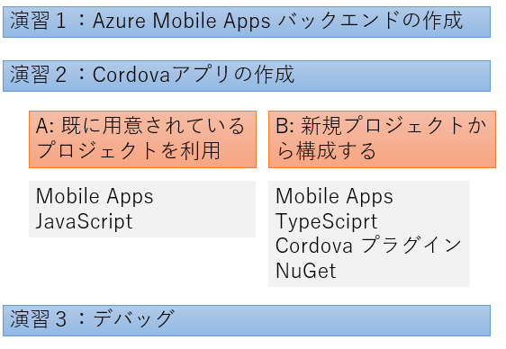
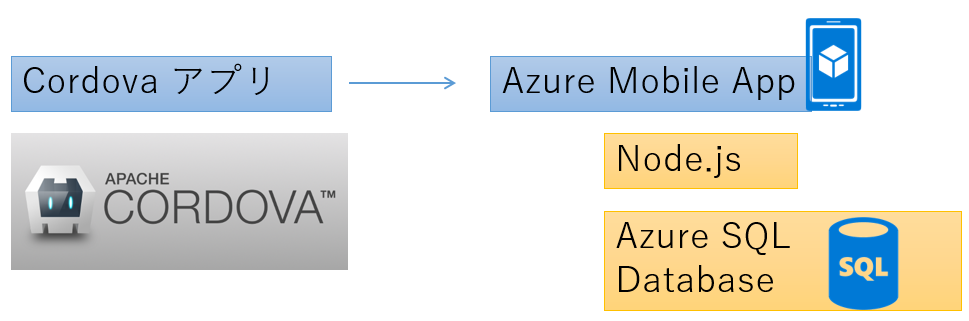

# Visual Studio Tools for Apache Cordova + Microsoft Azure Mobile Apps アプリ開発ハンズオン

このハンズオンでは、Visual Studio Tools for Apache Cordova を使用し、Cordova アプリの開発を行います。バックエンド側は Microsoft Azure Mobile Apps のインスタンスに接続し、クライアントである Cordova アプリよりデータのアクセスを行います。 

## 環境・事前準備

こちらを参考に、Visual Studio Tools for Apache Cordova をインストールしてください。

## 付録

[演習2で登場する gist リンク先](https://gist.github.com/hhyyg/a54e7e40dc89c570491141777f19078e)

