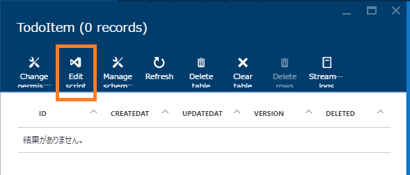
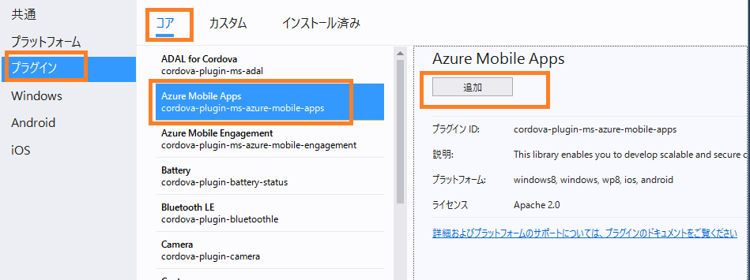

# Visual Studio Tools for Apache Cordova + Microsoft Azure Mobile Apps アプリ開発ハンズオン

このハンズオンでは、Visual Studio Tools for Apache Cordova を使用し、Cordova アプリの開発を行います。バックエンド側は Microsoft Azure Mobile Apps のインスタンスに接続し、クライアントである Cordova アプリよりデータのアクセスを行います。 

資料は Github [https://github.com/hhyyg/MisoCordovaHol](https://github.com/hhyyg/MisoCordovaHol) にもありますのでご利用ください。また、最新情報は GitHub 上にて行っております。
 
## 演習1 Azure Mobile Apps バックエンドを作成する

### 概要

このチュートリアルでは、Azure Mobile Apps バックエンドを作成し、Cordova アプリからデータのアクセスを行うための準備を行います。

### 前提条件

- アクティブな Azure アカウント

### Azure Mobile Apps バックエンドを作成する

+ [Azure ポータル](https://portal.azure.com/) にログインします。
+ [＋新規]、[Web + モバイル]、[Mobile App] の順にクリックします。

+ 「アプリ名」、「サブスクリプション」、「リソースグループ」、「App Service プラン」の情報を入力し、「作成」をクリックします。

リソースグループ、App Service プランは、既存のものを選択または新たに作成することができます。「アプリ名」は、Mobile Apps に接続するための URL の一部になりますので、記憶しておいてください。このドキュメントでは、例として「MobiSampleApp」として説明します。

「ダッシュボードにピン留め」にチェックを入れておくことをお勧めします。ポータルサイトからこの Mobile Apps のブレードへアクセスしやすくなります。

+ プロビジョニングにはやや時間がかかる可能性があります。作成した Mobile App のブレードを開きます。

見失った場合は、下の図のように「すべてのリソース」から該当の Mobile App を探します。

+ 作成した Mobile App のブレードにて、[全ての設定]、[クイックスタート]、[Cordova]を順に選択します。

+ Mobile App で使用するデータベース、Azure SQL Database を新規に用意します。[Connect a database] の下部をクリックし、[Add]　を選択します。

+ 「Type」に「SQL Database」を選択します。「SQL Database 必要な設定の構成」をクリックし新しくデータベースを作成します。
価格レベルは、ここでは「Free」でよいでしょう。「サーバー名」、「サーバー管理者ログイン」、「パスワード」を入力し、サーバーを新しく作成します。

この画像では、「mobi」というサーバーを新しく作成し、その配下に「MobiDB」という Azure SQL Database を新しく作成した操作の画面です。

+ 最後に、「Data Connections」ブレードの「OK」をクリックし、作成完了を待ちます。

+ Azure SQL Database の作成までやや時間がかかります。進捗状況は、右上の「通知マーク」から確認することができます。
 

～※しばらく待機します～

作成完了後は、下の図のように「You already have a data connection」と表示されます。

+ Azure SQL Database の作成後は、下の図のように「Node.js」を選択し、「Create TodoItem table」をクリックします。
「I acknowledge that this will overwrite all site contents.」にはチェックを入れてください。これは、"Node.js"を選択すると、Mobile App のサイトのコンテンツがすべて上書きされることを了承します" という意味になります。

この操作により、Mobile App に Node.js で構成されたバックエンドの用意と、Azure SQL Database にサンプルとして TodoItem 用のスキーマが作成されます。

～確認～

作成されたテーブルと、Node.js で構成されたバックエンドを確認してみましょう。

+ [すべての設定]、[Easy Table]、[TodoItem] の順にクリックします。上の図のように、TodoItem テーブルが作成され、データが空であることが確認できます。

+ [Edit Script] をクリックします。Visual Studio Online "Monaco" ツールより、Node.js で構成されたバックエンドの内容を確認することができます。（※コードは今は編集しないでください。）

## 演習2 Cordova アプリを作成し、Azure Mobile App に接続する

### 概要

このチュートリアルでは、Visual Studio Tools for Apache Cordova を使用し、Cordova アプリを作成した後、演習1 で作成した Azure Mobile App に接続します。

既に構成されているプロジェクトを利用する A の方法と、新規からプロジェクトを作成する B の方法を記載しています。 B の方では、TypeScript、Cordova プラグイン、NuGet のインストールの仕組みに触れることができます。
まず、A からはじめて次に B を行うことをおすすめします。

### 前提条件

- 演習1 の完了
- Visual Studio 2015 Update 2
  - Visual Studio Tools for Apache Cordova がインストールされていること

### A: プロジェクトファイルをダウンロードし、Azure Mobile App に接続する

+ [Azure Portal](https://portal.azure.com/) にアクセスし、演習1で作成した Mobile Apps のブレードを開きます。

+ [すべての設定]、[クイックスタート]、[Cordova]の順にクリックします。

+ [Create A NEW APP] 、[Download] をクリックします。Visual Studio のプロジェクトファイル群の .zip のダウンロードが開始されます。ダウンロード後、.zip ファイルを解凍します。
 

+ .slnファイル（図ではMobiSampleApp.sln）を Visual Studio 2015 で開きます。

「www/js/index.js」を開き、URL が対象の Azure Mobile Apps の URL であることを確認します。

www/js/index.js :

    //...
    function onDeviceReady() {
        // Create a connection reference to our Azure Mobile Apps backend
        client = new WindowsAzure.MobileServiceClient('https://mobisampleapp.azurewebsites.net');
    //...

+ 画像のように上部のデバッグボタンをクリックし、「Ripple - Nexus(Galaxy)」をクリックし、デバッグを開始します。（Google Android エミュレーター等ほかの選択肢でもかまいません。）

画像のようにデバッグボタンが表示されていない場合、ツールバーの領域で右クリックし、「標準」にチェックをいれると表示されます。

しばらくするとエミュレーターが立ち上がり、図のようにアプリケーションの画面が表示されます。

（もし、ここで Internal Server Error 500 が表示される場合、F5 で再起動、またはデバッグを再度行ってみてください。）

+ テキストを入力し「Add」をクリックして、データをいくつか追加してみましょう。

このとき、Mobile Apps へ接続が行われ、データの追加が行われています。後述の手順で、Azure ポータルサイトより追加されたデータを確認してみましょう。

### Azure ポータルサイトから、Mobile Apps のデータの中身を確認する

+ [Azure Portal](https://portal.azure.com/) にアクセスし、対象の Mobile Apps のブレードを開きます。

+ [すべての設定]、[Easy Tables]、[TodoItem] をクリックします。

+ 図のように追加されたデータを確認することができます。

データは Azure SQL Databse に格納されているので、SQL Server Management Tool 等から接続してデータを確認することも可能です。

## B: プロジェクトテンプレートから Cordova プロジェクトを新規作成し、Azure Mobile Apps に接続する

A では、予め用意されているプロジェクトを実行しましたが、この B では、一からプロジェクトを作成し Cordova アプリの開発の仕組みを掴みます。
また、TypeScript で記述します。

+ Visual Studio 2015 を開きます。
+ [ファイル]、[新規作成]、[プロジェクト] をクリックします。

+ [他の言語]、[TypeScript]、[Apache Cordova Apps]を選択し、名前欄に任意を入力し、「OK」をクリックします。

※Visual Studio Tools for Apache Cordova には、JavaSciprt と TypeScript の 2 つのプロジェクトテンプレートが用意されています。
ここでは「TypeSciprt」を選択します。

+ プロジェクト作成後、「ソリューションエクスプローラー」より、プロジェクトの構成を確認します。次の3つのファイルがあることを確認します。

- scripts/typings : TypeScript の型定義ファイルが格納されます。最初には、Cordova プラグイン API の型定義ファイルが格納されています。
- scripts/index.ts : TypeSciprt のファイルです。このプロジェクトのデフォルトのファイルになります。
- scripts/tsconfig.json : TypeScript のコンパイルオプションの設定ファイルです。設定については[tsconfig.json](http://www.typescriptlang.org/docs/handbook/tsconfig.json.html)を参照します。

+ TypeScript のコンパイルを確認します。「ソリューションエクスプローラー」にてプロジェクトを右クリック、「ビルド」をクリックします。

ビルドの後、「www/scripts」フォルダの中に「appBundle.js」が生成されることを確認します。TypeSciprtで書かれた「scripts/index.ts」がコンパイルされ、JavaScriptで書かれた「appBundle.js」が生成されたことを意味します。

この動作は、「scripts/tsconfig.json」に書かれたコンパイルオプションに依存します。tsconfig.json に `"out": "www/scripts/appBundle.js"` と記述があることを確認してください。

scripts/tsconfig.json :

    {
        "compilerOptions": {
            "noImplicitAny": false,
            "noEmitOnError": true,
            "removeComments": false,
            "sourceMap": true,
            "inlineSources": true,
            "out": "www/scripts/appBundle.js",
            "target": "es5"
        }
    }

次に、「www/index.html」に「appBundle.js」の参照の記述があることを確認します。

www/index.html :

    

index.html は、アプリが起動したときに最初に表示されるページです。以上より、「scripts/index.ts」に書かれた TypeSciprt のロジックが、アプリ起動時に読み込まれることが確認できます。
    
※現在の Visual Studio Tools for Apache Cordova では、「/scripts」フォルダ内での TypeScript ファイルのみ対応しています。

+ 次に、Azure Mobile Apps への接続を行います。接続を行うには、Cordova プラグインである「cordova-plugin-ms-azure-mobile-apps」をインストールします。

参照：[cordova-plugin-ms-azure-mobile-apps のページ](https://www.npmjs.com/package/cordova-plugin-ms-azure-mobile-apps)

+ 「ソリューションエクスプローラー」にて「config.xml」を開きます。図のようにデザイナが展開されます。

+ 左タブの「プラグイン」をクリックし、図のように「コア」、「Azure Mobile Apps」、「追加」をクリックします。

Cordova プラグインをインストールすると、「plugins」フォルダに各種ファイルが格納されます。図のように「cordova-plugin-ms-azure-mobile-apps」フォルダが作成されていることを確認します。

+ 次に、Html の DOM の操作を行うために jQuery を NuGet を使ってインストールを行います。

+ 「ソリューションエクスプローラー」にてプロジェクトを右クリックし、「NuGet パッケージの管理」をクリックします。

+ [参照]のタブにて[jQuery]と入力し、「インストール」をクリックします。

+ 「scripts/jquery-2.2.3.min.js」 を、「www/scripts」フォルダ内にドラッグして移動します。

以下のファイルは削除しても構いません。

- scripts/jquery-2.2.3.intellisense.js
- scripts/jquery-2.2.3.js
- scripts/jquery-2.2.3.min.map

以上で、Mobile Apps への接続、jQuery のライブラリの準備が完了しました。

TypeSciprtファイル「index.ts」にて、Mobile Apps に接続しデータを Html に出力するロジックを書くには、以下の 2つの TypeSciprt 型定義ファイルが必要です。
（型定義ファイルがないと、TypeSciprt のコンパイルエラーになります。）

- Mobile Apps 用の TypeScript 型定義ファイル
- jQuery の TypeSciprt 方定義ファイル

（jQuery は Html の操作のために今回選択しました。他、AngularJS を使うといった方法もあります。）
この型定義ファイルのインストールは、今回は NuGet を使って行います。

+ 先ほどと同じように、「ソリューションエクスプローラー」を右クリックし、「NuGetパッケージの管理」をクリックします。

図のように、下記の 2 つのパッケージをインストールします。 

azure-mobile-services-client.TypeScript.DefinitelyTyped :

jquery.TypeScript.DefinitelyTyped :

インストールが完了すると、「scripts/typings」フォルダ内に「**.d.ts」という型定義ファイルが追加されます。

+ 次の 3 つのファイルを、口述のコードそのままに置き換えます。

- www/css/index.css
- www/index.html
- scripts/index.ts

コードは、[GitHub の gist](https://gist.github.com/hhyyg/a54e7e40dc89c570491141777f19078e) に上げておりますので、コピーを行ってください。

+ デバッグを開始し、エミュレーターにて Todo の操作を行うことができれば成功です。

## 演習3. デバッグしてみよう

### ブレークポイントの設置

「index.ts」の変数を確認したいところで、図のようにブレークポイントを設定します。

デバッグ実行すると、図のように処理の実行を停止できます。

F10 キーよりステップオーバーの実行や、変数のウォッチを行うことができます。 

### DOM Explorer

「Ripple Nexus (Galaxy)」をターゲットにしデバッグ実行を行います。
デバッグが開始されると、DOM Explorer が開きます。表示されない場合は、デバッグ中に Visual Studio のメニューにて[デバッグ]>[ウィンドウ]>[DOM Explorer]>[すべてを表示]をクリックしてください。

Dom Explorer の左上にあるアイコン（要素の選択）をクリックし、Ripple の画面上のとある要素をクリックすると、該当の要素が Dom Explorerにて確認できます。

右側の「スタイル」より CSS を編集しプレビューとして確認することができます。

### JavaSciprt コンソール

「Ripple Nexus (Galaxy)」をターゲットにしデバッグ実行を行います。
JavaSciprt コンソールウィンドウを表示します。表示されない場合は、デバッグ中に Visual Studio のメニューにて[デバッグ]>[ウィンドウ]>[JavaSciprt コンソール]をクリックしてください。

下部にある入力欄で、例として「document.」とタイプすると、インテリセンスから情報を確認することができます。「document.baseURI」と入力し、実行してみましょう。

   
 
これらの確認は、デバッグのターゲットを「Ripple」としている場合は、Chrome の F12 開発者ツールからも行うことができます。

## エラーになる場合

- デバッグ時に何らかのエラーが発生した場合、次の操作よりキャッシュをクリアにして再度トライしてみてください。

[ツール]>[オプション]を開きます。「Tools for Apache Cordova」の欄より、「Cordova キャッシュのクリア」をクリックします。

- TypeSciprt のコンパイル後に生成される JavaScript ファイルにて、日本語が文字化けする場合

TypeScript ファイルを、「日本語JIS」ではなく「UTF8」で保存します。該当の TypeSciprt を開きます。
[ファイル]>[名前を付けて ***.ts を保存]をクリックし、「エンコード付きで保存します」をクリックします。「上書きしますか？」のアラートで「はい」を選択します。

エンコードを UTF8 を選択し、「OK」をクリックし、再度コンパイルを行います。

  

