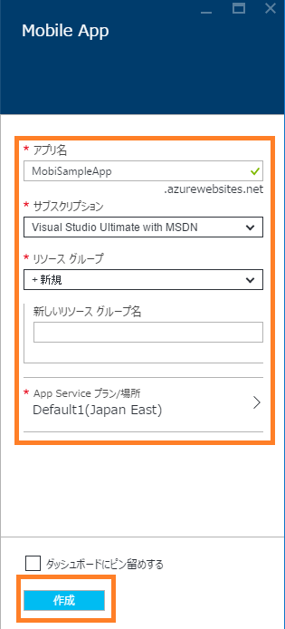
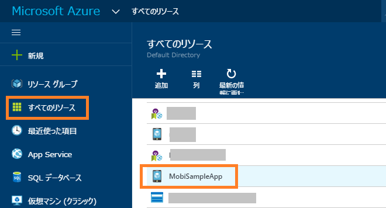
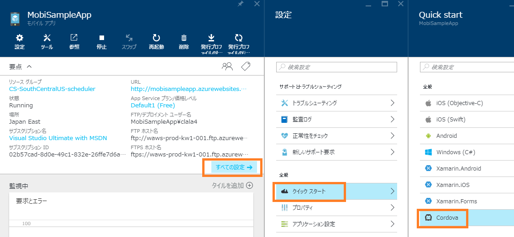
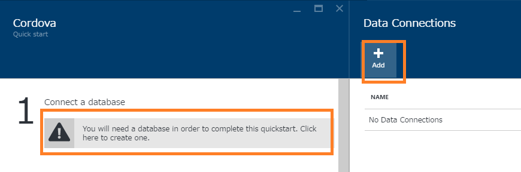
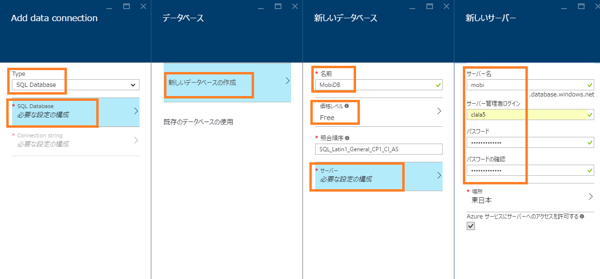
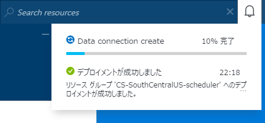

# Visual Studio Tools for Apache Cordova + Microsoft Azure Mobile Apps アプリ開発ハンズオン

このハンズオンでは、Visual Studio Tools for Apache Cordova を使用し、Cordova アプリの開発を行います。バックエンド側は Microsoft Azure Mobile Apps のインスタンスに接続し、クライアントである Cordova アプリよりデータのアクセスを行います。 

資料は Github [https://github.com/hhyyg/MisoCordovaHol](https://github.com/hhyyg/MisoCordovaHol) にもありますのでご利用ください。また、最新情報は GitHub 上にて行っております。
 
## 演習1 Azure Mobile Apps バックエンドを作成する

### 概要

このチュートリアルでは、Azure Mobile Apps バックエンドを作成し、Cordova アプリからデータのアクセスを行うための準備を行います。

### 前提条件

- アクティブな Azure アカウント

### Azure Mobile Apps バックエンドを作成する

+ [Azure ポータル](https://portal.azure.com/) にログインします。
+ [＋新規]、[Web + モバイル]、[Mobile App] の順にクリックします。

+ 「アプリ名」、「サブスクリプション」、「リソースグループ」、「App Service プラン」の情報を入力し、「作成」をクリックします。

リソースグループ、App Service プランは、既存のものを選択または新たに作成することができます。「アプリ名」は、Mobile Apps に接続するための URL の一部になりますので、記憶しておいてください。このドキュメントでは、例として「MobiSampleApp」として説明します。

「ダッシュボードにピン留め」にチェックを入れておくことをお勧めします。ポータルサイトからこの Mobile Apps のブレードへアクセスしやすくなります。

+ プロビジョニングにはやや時間がかかる可能性があります。作成した Mobile App のブレードを開きます。

見失った場合は、下の図のように「すべてのリソース」から該当の Mobile App を探します。

+ 作成した Mobile App のブレードにて、[全ての設定]、[クイックスタート]、[Cordova]を順に選択します。

+ Mobile App で使用するデータベース、Azure SQL Database を新規に用意します。[Connect a database] の下部をクリックし、[Add]　を選択します。

+ 「Type」に「SQL Database」を選択します。「SQL Database 必要な設定の構成」をクリックし新しくデータベースを作成します。
価格レベルは、ここでは「Free」でよいでしょう。「サーバー名」、「サーバー管理者ログイン」、「パスワード」を入力し、サーバーを新しく作成します。

この画像では、「mobi」というサーバーを新しく作成し、その配下に「MobiDB」という Azure SQL Database を新しく作成した操作の画面です。

+ 最後に、「Data Connections」ブレードの「OK」をクリックし、作成完了を待ちます。

+ Azure SQL Database の作成までやや時間がかかります。進捗状況は、右上の「通知マーク」から確認することができます。
 

～※しばらく待機します～

作成完了後は、下の図のように「You already have a data connection」と表示されます。

+ Azure SQL Database の作成後は、下の図のように「Node.js」を選択し、「Create TodoItem table」をクリックします。
「I acknowledge that this will overwrite all site contents.」にはチェックを入れてください。これは、"Node.js"を選択すると、Mobile App のサイトのコンテンツがすべて上書きされることを了承します" という意味になります。

この操作により、Mobile App に Node.js で構成されたバックエンドの用意と、Azure SQL Database にサンプルとして TodoItem 用のスキーマが作成されます。

～確認～

作成されたテーブルと、Node.js で構成されたバックエンドを確認してみましょう。

+ [すべての設定]、[Easy Table]、[TodoItem] の順にクリックします。上の図のように、TodoItem テーブルが作成され、データが空であることが確認できます。

+ [Edit Script] をクリックします。Visual Studio Online "Monaco" ツールより、Node.js で構成されたバックエンドの内容を確認することができます。（※コードは今は編集しないでください。）

