## 演習2 Cordova アプリを作成し、Azure Mobile App に接続する

### 概要

このチュートリアルでは、Visual Studio Tools for Apache Cordova を使用し、Cordova アプリを作成した後、演習1 で作成した Azure Mobile App に接続します。

既に構成されているプロジェクトを利用する A の方法と、新規からプロジェクトを作成する B の方法を記載しています。 B の方では、TypeScript、Cordova プラグイン、NuGet のインストールの仕組みに触れることができます。
まず、A からはじめて次に B を行うことをおすすめします。

### 前提条件

- 演習1 の完了
- Visual Studio 2015 Update 2
  - Visual Studio Tools for Apache Cordova がインストールされていること

### A: プロジェクトファイルをダウンロードし、Azure Mobile App に接続する

+ [Azure Portal](https://portal.azure.com/) にアクセスし、演習1で作成した Mobile Apps のブレードを開きます。

+ [すべての設定]、[クイックスタート]、[Cordova]の順にクリックします。

+ [Create A NEW APP] 、[Download] をクリックします。Visual Studio のプロジェクトファイル群の .zip のダウンロードが開始されます。ダウンロード後、.zip ファイルを解凍します。
 
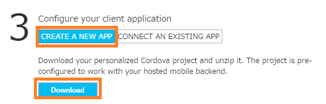

+ .slnファイル（図ではMobiSampleApp.sln）を Visual Studio 2015 で開きます。

「www/js/index.js」を開き、URL が対象の Azure Mobile Apps の URL であることを確認します。

www/js/index.js :

    //...
    function onDeviceReady() {
        // Create a connection reference to our Azure Mobile Apps backend
        client = new WindowsAzure.MobileServiceClient('https://mobisampleapp.azurewebsites.net');
    //...

+ 画像のように上部のデバッグボタンをクリックし、「Ripple - Nexus(Galaxy)」をクリックし、デバッグを開始します。（Google Android エミュレーター等ほかの選択肢でもかまいません。）

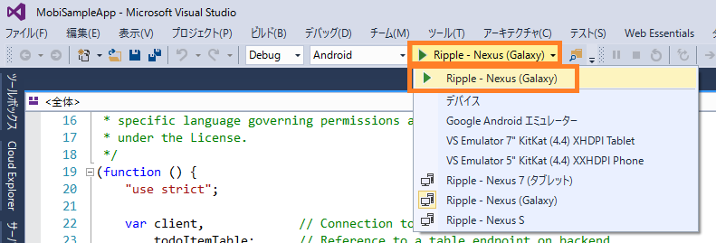

画像のようにデバッグボタンが表示されていない場合、ツールバーの領域で右クリックし、「標準」にチェックをいれると表示されます。

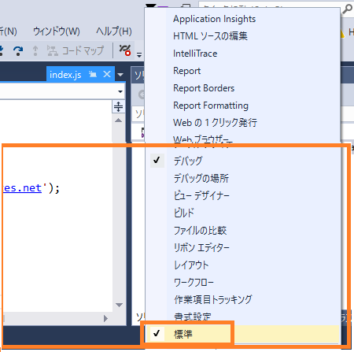

しばらくするとエミュレーターが立ち上がり、図のようにアプリケーションの画面が表示されます。

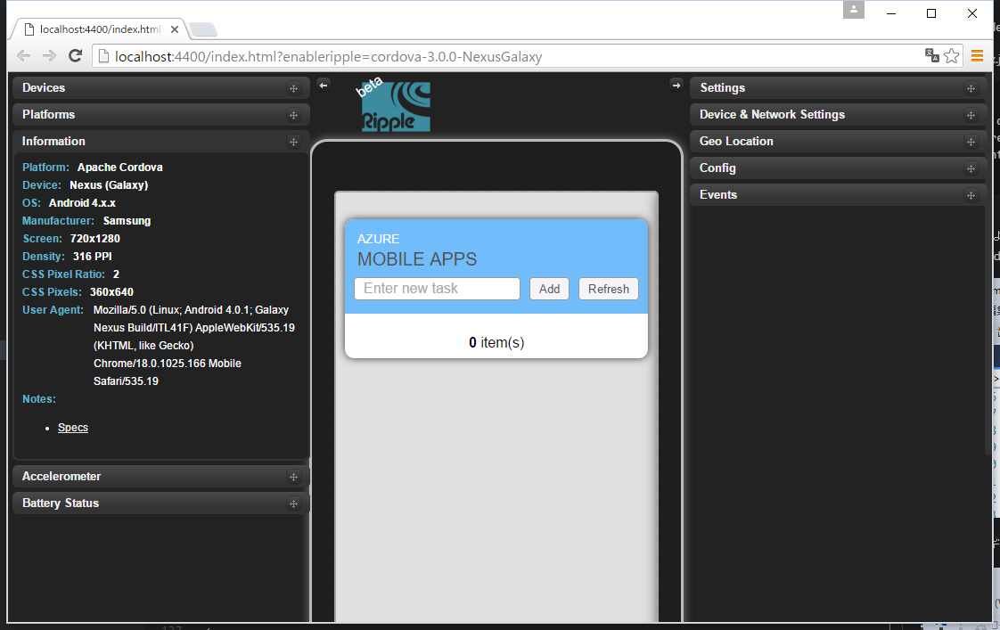

（もし、ここで Internal Server Error 500 が表示される場合、F5 で再起動、またはデバッグを再度行ってみてください。）

+ テキストを入力し「Add」をクリックして、データをいくつか追加してみましょう。

このとき、Mobile Apps へ接続が行われ、データの追加が行われています。後述の手順で、Azure ポータルサイトより追加されたデータを確認してみましょう。

### Azure ポータルサイトから、Mobile Apps のデータの中身を確認する

+ [Azure Portal](https://portal.azure.com/) にアクセスし、対象の Mobile Apps のブレードを開きます。

+ [すべての設定]、[Easy Tables]、[TodoItem] をクリックします。

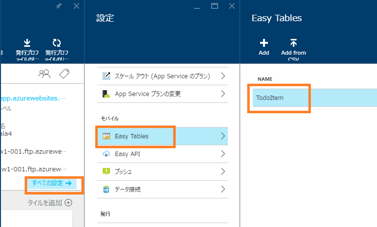

+ 図のように追加されたデータを確認することができます。

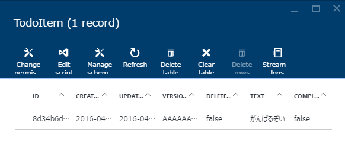

データは Azure SQL Databse に格納されているので、SQL Server Management Tool 等から接続してデータを確認することも可能です。

## B: プロジェクトテンプレートから Cordova プロジェクトを新規作成し、Azure Mobile Apps に接続する

A では、予め用意されているプロジェクトを実行しましたが、この B では、一からプロジェクトを作成し Cordova アプリの開発の仕組みを掴みます。
また、TypeScript で記述します。

+ Visual Studio 2015 を開きます。
+ [ファイル]、[新規作成]、[プロジェクト] をクリックします。

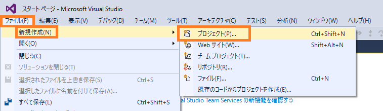

+ [他の言語]、[TypeScript]、[Apache Cordova Apps]を選択し、名前欄に任意を入力し、「OK」をクリックします。

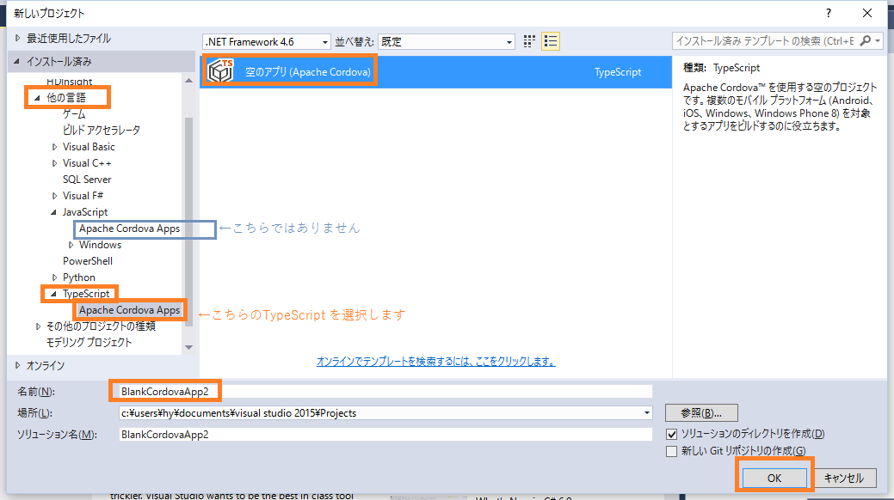

※Visual Studio Tools for Apache Cordova には、JavaSciprt と TypeScript の 2 つのプロジェクトテンプレートが用意されています。
ここでは「TypeSciprt」を選択します。

+ プロジェクト作成後、「ソリューションエクスプローラー」より、プロジェクトの構成を確認します。次の3つのファイルがあることを確認します。

- scripts/typings : TypeScript の型定義ファイルが格納されます。最初には、Cordova プラグイン API の型定義ファイルが格納されています。
- scripts/index.ts : TypeSciprt のファイルです。このプロジェクトのデフォルトのファイルになります。
- scripts/tsconfig.json : TypeScript のコンパイルオプションの設定ファイルです。設定については[tsconfig.json](http://www.typescriptlang.org/docs/handbook/tsconfig.json.html)を参照します。

+ TypeScript のコンパイルを確認します。「ソリューションエクスプローラー」にてプロジェクトを右クリック、「ビルド」をクリックします。

ビルドの後、「www/scripts」フォルダの中に「appBundle.js」が生成されることを確認します。TypeSciprtで書かれた「scripts/index.ts」がコンパイルされ、JavaScriptで書かれた「appBundle.js」が生成されたことを意味します。

この動作は、「scripts/tsconfig.json」に書かれたコンパイルオプションに依存します。tsconfig.json に `"out": "www/scripts/appBundle.js"` と記述があることを確認してください。

scripts/tsconfig.json :

    {
        "compilerOptions": {
            "noImplicitAny": false,
            "noEmitOnError": true,
            "removeComments": false,
            "sourceMap": true,
            "inlineSources": true,
            "out": "www/scripts/appBundle.js",
            "target": "es5"
        }
    }

次に、「www/index.html」に「appBundle.js」の参照の記述があることを確認します。

www/index.html :

    

index.html は、アプリが起動したときに最初に表示されるページです。以上より、「scripts/index.ts」に書かれた TypeSciprt のロジックが、アプリ起動時に読み込まれることが確認できます。
    
※現在の Visual Studio Tools for Apache Cordova では、「/scripts」フォルダ内での TypeScript ファイルのみ対応しています。

+ 次に、Azure Mobile Apps への接続を行います。接続を行うには、Cordova プラグインである「cordova-plugin-ms-azure-mobile-apps」をインストールします。

参照：[cordova-plugin-ms-azure-mobile-apps のページ](https://www.npmjs.com/package/cordova-plugin-ms-azure-mobile-apps)

+ 「ソリューションエクスプローラー」にて「config.xml」を開きます。図のようにデザイナが展開されます。

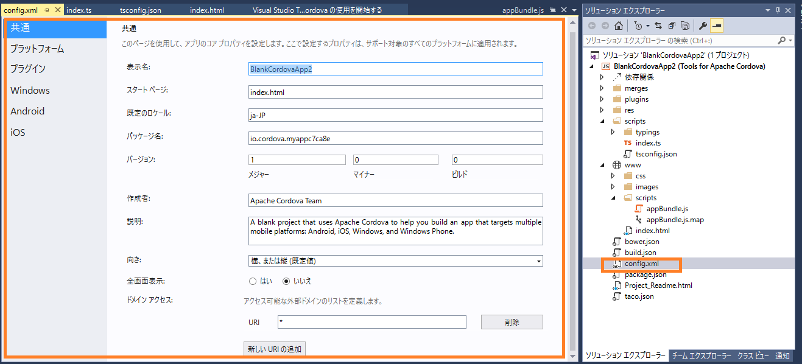

+ 左タブの「プラグイン」をクリックし、図のように「コア」、「Azure Mobile Apps」、「追加」をクリックします。

Cordova プラグインをインストールすると、「plugins」フォルダに各種ファイルが格納されます。図のように「cordova-plugin-ms-azure-mobile-apps」フォルダが作成されていることを確認します。

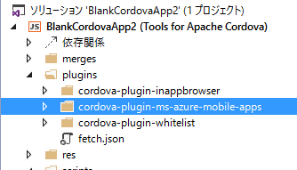

+ 次に、Html の DOM の操作を行うために jQuery を NuGet を使ってインストールを行います。

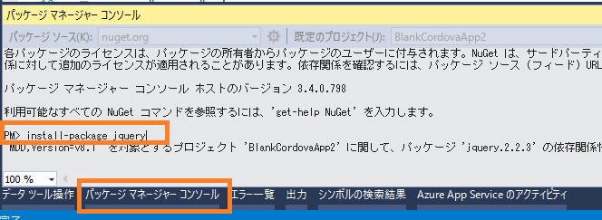

+ 「ソリューションエクスプローラー」にてプロジェクトを右クリックし、「NuGet パッケージの管理」をクリックします。

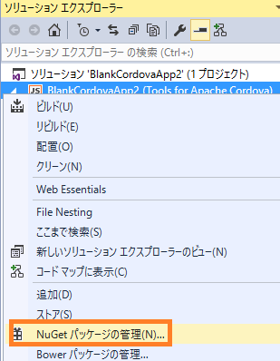

+ [参照]のタブにて[jQuery]と入力し、「インストール」をクリックします。

+ 「scripts/jquery-2.2.3.min.js」 を、「www/scripts」フォルダ内にドラッグして移動します。

以下のファイルは削除しても構いません。

- scripts/jquery-2.2.3.intellisense.js
- scripts/jquery-2.2.3.js
- scripts/jquery-2.2.3.min.map

以上で、Mobile Apps への接続、jQuery のライブラリの準備が完了しました。

TypeSciprtファイル「index.ts」にて、Mobile Apps に接続しデータを Html に出力するロジックを書くには、以下の 2つの TypeSciprt 型定義ファイルが必要です。
（型定義ファイルがないと、TypeSciprt のコンパイルエラーになります。）

- Mobile Apps 用の TypeScript 型定義ファイル
- jQuery の TypeSciprt 方定義ファイル

（jQuery は Html の操作のために今回選択しました。他、AngularJS を使うといった方法もあります。）
この型定義ファイルのインストールは、今回は NuGet を使って行います。

+ 先ほどと同じように、「ソリューションエクスプローラー」を右クリックし、「NuGetパッケージの管理」をクリックします。

図のように、下記の 2 つのパッケージをインストールします。 

azure-mobile-services-client.TypeScript.DefinitelyTyped :

jquery.TypeScript.DefinitelyTyped :

インストールが完了すると、「scripts/typings」フォルダ内に「**.d.ts」という型定義ファイルが追加されます。

+ 次の 3 つのファイルを、後述のコードそのままに置き換えます。

- www/css/index.css
- www/index.html
- scripts/index.ts

コードは、[GitHub の gist](https://gist.github.com/hhyyg/a54e7e40dc89c570491141777f19078e) に上げておりますので、コピーを行ってください。

+ ★注意★ www/index.html の下のように「Content-Security-Policy」とある行にある URL を、接続先の Azure Mobile Apps の URL に書き換えてください。

    <meta http-equiv="Content-Security-Policy" content="default-src 'self' data: gap: https://***書き換えてください***.azurewebsites.net; style-src 'self'; media-src *">

（書き換えないと※実機でデバッグした際にエラーになる可能性があります。）

+ デバッグを開始し、エミュレーターにて Todo の操作を行うことができれば成功です。

