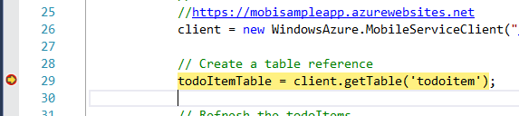
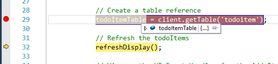
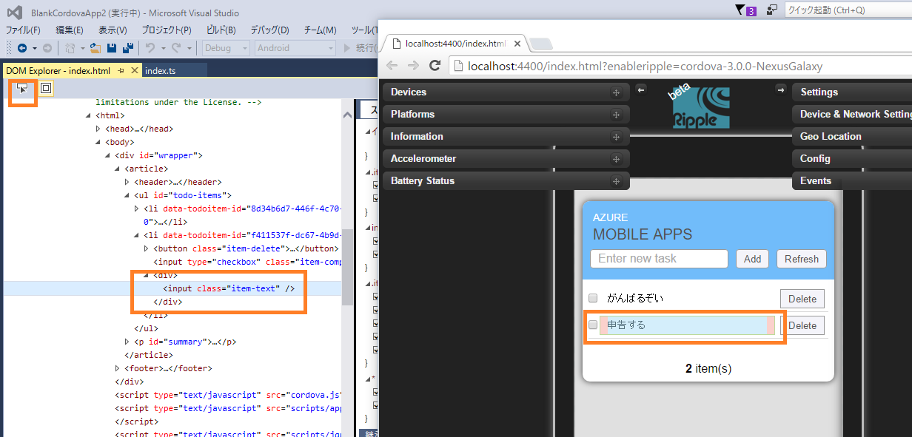
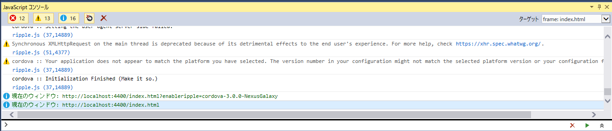
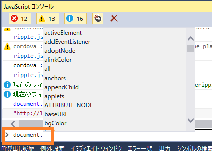
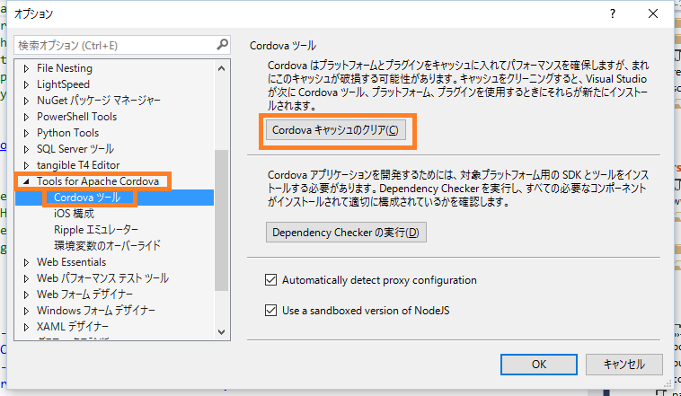
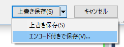
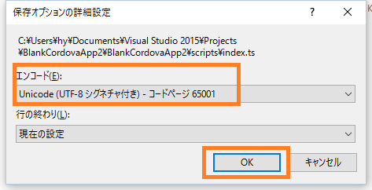

## 演習3. デバッグしてみよう

### ブレークポイントの設置

「index.ts」の変数を確認したいところで、図のようにブレークポイントを設定します。

デバッグ実行すると、図のように処理の実行を停止できます。

F10 キーよりステップオーバーの実行や、変数のウォッチを行うことができます。 

### DOM Explorer

「Ripple Nexus (Galaxy)」をターゲットにしデバッグ実行を行います。
デバッグが開始されると、DOM Explorer が開きます。表示されない場合は、デバッグ中に Visual Studio のメニューにて[デバッグ]>[ウィンドウ]>[DOM Explorer]>[すべてを表示]をクリックしてください。

Dom Explorer の左上にあるアイコン（要素の選択）をクリックし、Ripple の画面上のとある要素をクリックすると、該当の要素が Dom Explorerにて確認できます。

右側の「スタイル」より CSS を編集しプレビューとして確認することができます。

### JavaSciprt コンソール

「Ripple Nexus (Galaxy)」をターゲットにしデバッグ実行を行います。
JavaSciprt コンソールウィンドウを表示します。表示されない場合は、デバッグ中に Visual Studio のメニューにて[デバッグ]>[ウィンドウ]>[JavaSciprt コンソール]をクリックしてください。

下部にある入力欄で、例として「document.」とタイプすると、インテリセンスから情報を確認することができます。「document.baseURI」と入力し、実行してみましょう。

   
 
これらの確認は、デバッグのターゲットを「Ripple」としている場合は、Chrome の F12 開発者ツールからも行うことができます。

## エラーになる場合

- デバッグ時に何らかのエラーが発生した場合、次の操作よりキャッシュをクリアにして再度トライしてみてください。

[ツール]>[オプション]を開きます。「Tools for Apache Cordova」の欄より、「Cordova キャッシュのクリア」をクリックします。

- TypeSciprt のコンパイル後に生成される JavaScript ファイルにて、日本語が文字化けする場合

TypeScript ファイルを、「日本語JIS」ではなく「UTF8」で保存します。該当の TypeSciprt を開きます。
[ファイル]>[名前を付けて ***.ts を保存]をクリックし、「エンコード付きで保存します」をクリックします。「上書きしますか？」のアラートで「はい」を選択します。

エンコードを UTF8 を選択し、「OK」をクリックし、再度コンパイルを行います。

  

